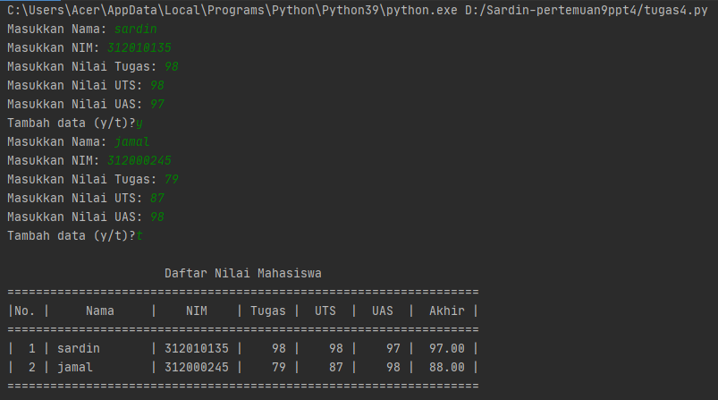

    nim = input("Masukkan NIM: ")
    tugas = int(input("Masukkan Nilai Tugas: "))
    uts = int(input("Masukkan Nilai UTS: "))
    uas = int(input("Masukkan Nilai UAS: "))
    akhir = (tugas * 30/100) + (uts * 35/100) + (uas * 35/100)

    nilai.append([nama, nim, tugas, uts, uas, int(akhir)])
    if (input("Tambah data (y/t)?") == 't'):
        ulang = False

print("\n                      Daftar Nilai Mahasiswa")
print("==================================================================")
print("|No. |     Nama     |    NIM    | Tugas |  UTS  |  UAS  |  Akhir |")
print("==================================================================")
i = 0
for item in nilai:
    i += 1
    print("| {no:2d} | {nama:12s} | {nim:9s} | {tugas:5d} | {uts:5d} | {uas:5d} | {akhir:6.2f} |"
          .format(no=i, nama=item[0], nim=item[1], tugas=item[2], uts=item[3], uas=item[4], akhir=item[5]))
print("==================================================================")
```
#### Penjelasan:
* Pertama kita membuat variable list kosong. <br>
```python
nilai = []
ulang = True
```
Variable ```ulang = True``` digunakan untuk mengontrol perulangan. <br>

* Lalu kita membuat kondisi perulangan dan statement yang akan dijalankan ketika perulangan terjadi. <br>
```python
while ulang:
    nama = input("Masukkan Nama: ")
    nim = input("Masukkan NIM: ")
    tugas = int(input("Masukkan Nilai Tugas: "))
    uts = int(input("Masukkan Nilai UTS: "))
    uas = int(input("Masukkan Nilai UTS: "))
    akhir = (tugas * 30/100) + (uts * 35/100) + (uas * 35/100)

    nilai.append([nama, nim, tugas, uts, uas, int(akhir)])
```
Dari statement diatas, kita akan diminta untuk menginput nama, nim, nilai tugas, nilai uts, dan nilai uas, lalu system akan menjumlahkan nilai-nilai tersebut dan menghasilkan nilai akhir. <br>
Setelah menginput berbagai data atau item, inputan item tersebut akan masuk ke dalam list 'nilai' <br>

* Setelah membuat perulangan, kita membuat statement untuk menghentikan atau keluar dari perulangan yang terjadi. <br>
```python
    if (input("Tambah data (y/t)?") == 't'):
        ulang = False
```
Untuk keluar dari perulangan kita hanya perlu menginputkan 't' apabila diminta pada saat program dijalankan.
't' akan membuat variable ```ulang = True``` menjadi ```ulang = False``` yang mana akan menghentikan perulangan yang terjadi. <br>

* Terakhir kita akan mencetak hasil dari program yang telah dibuat. <br>
```python
print("\n                      Daftar Nilai Mahasiswa")
print("==================================================================")
print("|No. |     Nama     |    NIM    | Tugas |  UTS  |  UAS  |  Akhir |")
print("==================================================================")
i = 0
for item in nilai:
    i += 1
    print("| {no:2d} | {nama:12s} | {nim:9s} | {tugas:5d} | {uts:5d} | {uas:5d} | {akhir:6.2f} |"
          .format(no=i, nama=item[0], nim=item[1], tugas=item[2], uts=item[3], uas=item[4], akhir=item[5]))
print("==================================================================")
```
* Hasil dari program yang telah dibuat <br>



### SEKIAN TERIMAKASI


